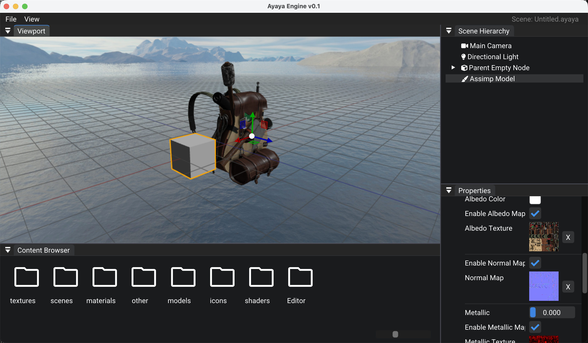

# Ayaya

Ayaya: a game engine developed on Mac



``` bash
# Create a build directory
mkdir build && cd build
# Compile the entire project
cmake .. && make -j$(sysctl -n hw.ncpu)
rm -rf * && cmake .. && make -j$(sysctl -n hw.ncpu)
# Compile the editor separately
cmake .. && make AyayaEditor -j$(sysctl -n hw.ncpu)
# Compile the test project individually
cmake .. && make Sandbox -j$(sysctl -n hw.ncpu)
```