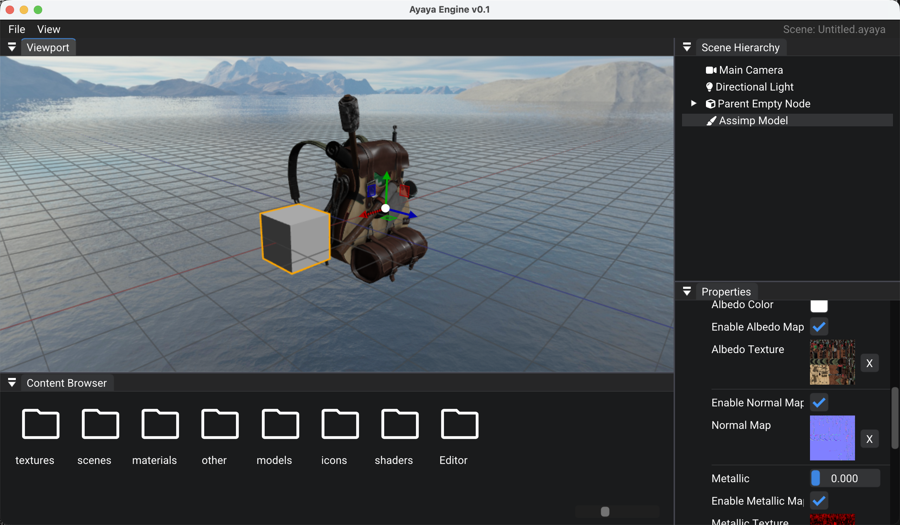

# Ayaya

Ayaya: a game engine




## Build 

Build on Mac

``` bash
# Create a build directory
mkdir build && cd build
# Compile the entire project
cmake .. && make -j$(sysctl -n hw.ncpu)
rm -rf * && cmake .. && make -j$(sysctl -n hw.ncpu)
# Compile the editor separately
cmake .. && make AyayaEditor -j$(sysctl -n hw.ncpu)
# Compile the test project individually
cmake .. && make Sandbox -j$(sysctl -n hw.ncpu)
```

or Build on Windows

```bash
# Create a build directory
mkdir build && cd build
# CMake generates solutions for Visual Studio
cmake .. -G "Visual Studio 17 2022" -A x64
# Compile the entire project
cmake --build . --config Release
# Compile the editor separately
cmake --build . --config Release --target AyayaEditor
# Compile the test project individually
cmake --build . --config Release --target Sandbox
```

