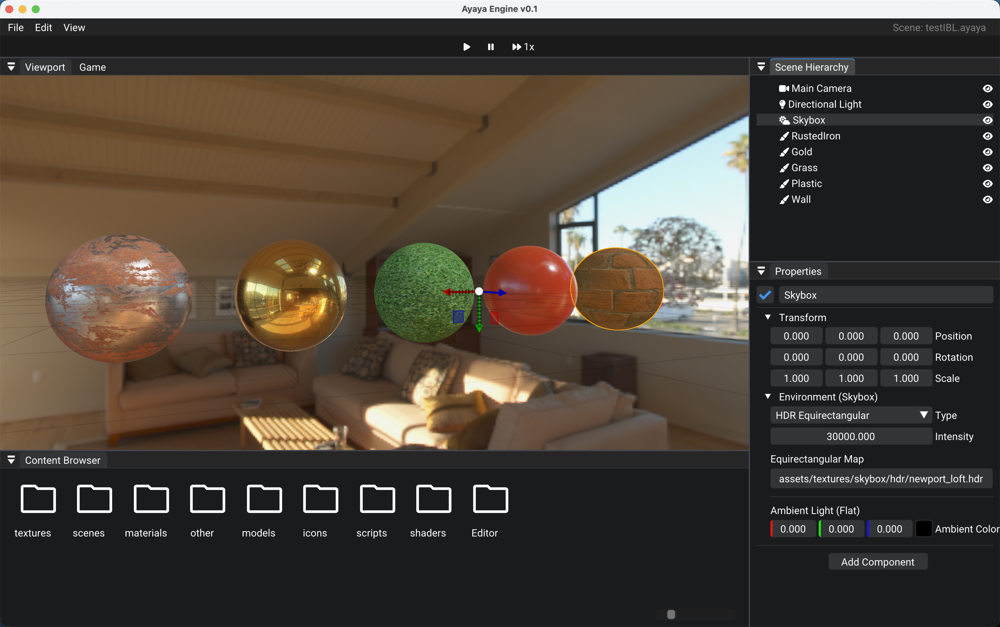

# Ayaya

Ayaya: a cross-platform game engine




## Build 

Build on Mac

``` bash
# Create a build directory
mkdir build && cd build
# Compile the entire project
cmake .. && make -j$(sysctl -n hw.ncpu)
rm -rf * && cmake .. && make -j$(sysctl -n hw.ncpu)
# Compile the editor separately
cmake .. && make AyayaEditor -j$(sysctl -n hw.ncpu)
# Compile the test project individually
cmake .. && make Sandbox -j$(sysctl -n hw.ncpu)
```

or Build on Windows

```bash
# Create a build directory
mkdir build && cd build
# CMake generates solutions for Visual Studio
cmake .. -G "Visual Studio 17 2022" -A x64
# Compile the entire project
cmake --build . --config Release
# Compile the editor separately
cmake --build . --config Release --target AyayaEditor
# Compile the test project individually
cmake --build . --config Release --target Sandbox
```

## Project Overview
* **Core Architecture**: ECS (Entity-Component-System) based on EnTT, Layer-based update loop, Graphics API-agnostic rendering wrapper.  
* **Rendering Pipeline**: Modern Data-Driven Forward Rendering with PBR (Physically Based Rendering), Frustum Culling, Render Queues (State Sorting), and hardware MSAA.  
* **Physics Backend**: Box2D (2D rigid body physics, fully integrated with the ECS lifecycle).
* **Scripting System**: "Dual-Track" Architecture (Runtime Lua + Editor Python). The runtime logic is powered by **Lua 5.4** and **Sol2**, deeply integrated with the ECS via `LuaScriptComponent`. It features per-entity sandboxed execution environments, real-time script hot-reloading (zero C++ recompilation), and seamless bindings to native C++ APIs (Transform, Input, etc.). Python integration for Editor automation and asset pipeline is currently in the roadmap.